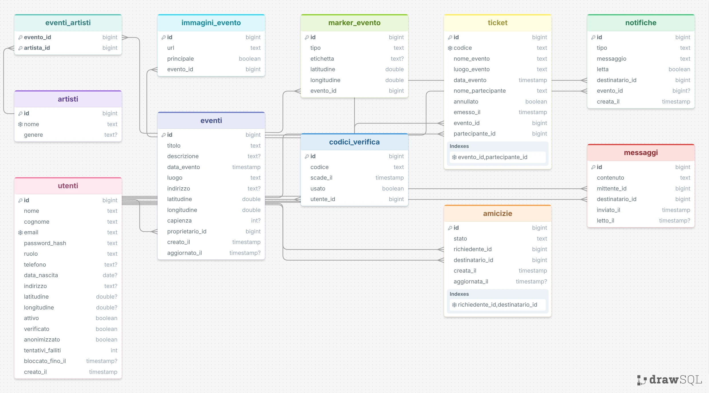

# Schema relazionale

Database: PostgreSQL 18, nome `BUILD-WEEK-5`, gestito con pgAdmin.
Lo schema è generato da Hibernate a partire dalle entità JPA.

## Diagramma delle relazioni

In sintesi: `utenti` è al centro (proprietario di `eventi`, partecipante nei
`ticket`, destinatario di `notifiche`, e sia richiedente sia destinatario in
`amicizie` e `messaggi`); `eventi` ha `immagini_evento`, `marker_evento`,
`ticket`, `notifiche` e un molti-a-molti con `artisti` tramite `eventi_artisti`.

## Tabelle

### utenti

| Colonna | Tipo | Vincoli |
|---|---|---|
| id | bigint | PK, identity |
| email | varchar(255) | NOT NULL, UNIQUE |
| password_hash | varchar(255) | NOT NULL |
| nome | varchar(60) | NOT NULL |
| cognome | varchar(60) | NOT NULL |
| indirizzo | varchar(2 55) | |
| data_nascita | date | |
| telefono | varchar(30) | |
| latitudine | double precision | |
| longitudine | double precision | |
| ruolo | varchar(20) | NOT NULL |
| verificato | boolean | NOT NULL, default false |
| attivo | boolean | NOT NULL, default true |
| anonimizzato | boolean | NOT NULL, default false |
| creato_il | timestamp | NOT NULL |

L'età si ricava da `data_nascita`: memorizzare l'età renderebbe il dato sbagliato
il giorno dopo. Un utente con `verificato = false` non può usare la piattaforma.

### codici_verifica

| Colonna | Tipo | Vincoli |
|---|---|---|
| id | bigint | PK |
| utente_id | bigint | NOT NULL, FK utenti(id), ON DELETE CASCADE |
| codice | varchar(6) | NOT NULL |
| scade_il | timestamp | NOT NULL |
| usato | boolean | NOT NULL, default false |

Il codice vale 15 minuti. Una nuova richiesta invalida i codici precedenti.

### eventi

| Colonna | Tipo | Vincoli |
|---|---|---|
| id | bigint | PK |
| titolo | varchar(140) | NOT NULL |
| descrizione | text | |
| data_evento | timestamp | NOT NULL |
| luogo | varchar(140) | NOT NULL |
| indirizzo | varchar(255) | |
| latitudine | double precision | NOT NULL |
| longitudine | double precision | NOT NULL |
| capienza | integer | CHECK > 0 |
| proprietario_id | bigint | NOT NULL, FK utenti(id) |
| creato_il | timestamp | NOT NULL |
| aggiornato_il | timestamp | |

Le colonne `latitudine` e `longitudine` restano `NOT NULL`: senza coordinate
l'evento non comparirebbe sulla mappa pubblica, che è il punto di ingresso
previsto dalla consegna. Nella richiesta di creazione, però, le coordinate sono
facoltative: se mancano vengono ricavate dall'`indirizzo` (o dal `luogo`)
tramite Google Geocoding prima del salvataggio (vedi debriefing 2.13 e
`04-api.md`).

### immagini_evento

| Colonna | Tipo | Vincoli |
|---|---|---|
| id | bigint | PK |
| evento_id | bigint | NOT NULL, FK eventi(id), ON DELETE CASCADE |
| url | varchar(500) | NOT NULL |
| principale | boolean | NOT NULL, default false |

L'immagine `principale` è quella passata all'AI insieme alla descrizione.

### artisti / eventi_artisti

| artisti | Tipo | Vincoli |
|---|---|---|
| id | bigint | PK |
| nome | varchar(120) | NOT NULL, UNIQUE |
| genere | varchar(60) | |

| eventi_artisti | Tipo | Vincoli |
|---|---|---|
| evento_id | bigint | PK composta, FK eventi(id) |
| artista_id | bigint | PK composta, FK artisti(id) |

Molti a molti: lo stesso artista suona a più eventi.

### marker_evento

| Colonna | Tipo | Vincoli |
|---|---|---|
| id | bigint | PK |
| evento_id | bigint | NOT NULL, FK eventi(id), ON DELETE CASCADE |
| tipo | varchar(20) | NOT NULL, in (INGRESSO, USCITA, USCITA_SICUREZZA) |
| etichetta | varchar(80) | |
| latitudine | double precision | NOT NULL |
| longitudine | double precision | NOT NULL |

### ticket

| Colonna | Tipo | Vincoli |
|---|---|---|
| id | bigint | PK |
| codice | varchar(36) | NOT NULL, UNIQUE |
| evento_id | bigint | NOT NULL, FK eventi(id) |
| partecipante_id | bigint | NOT NULL, FK utenti(id) |
| nome_evento | varchar(140) | NOT NULL |
| data_evento | timestamp | NOT NULL |
| nome_partecipante | varchar(140) | NOT NULL |
| emesso_il | timestamp | NOT NULL |
| annullato | boolean | NOT NULL, default false |

UNIQUE (evento_id, partecipante_id): un partecipante non può avere due ticket
per lo stesso evento. Le tre colonne denormalizzate sono la copia dei dati al
momento dell'emissione (vedi debriefing 2.2).

### notifiche

| Colonna | Tipo | Vincoli |
|---|---|---|
| id | bigint | PK |
| destinatario_id | bigint | NOT NULL, FK utenti(id) |
| evento_id | bigint | FK eventi(id) |
| tipo | varchar(30) | NOT NULL |
| messaggio | varchar(500) | NOT NULL |
| letta | boolean | NOT NULL, default false |
| creata_il | timestamp | NOT NULL |

Tipi: `EVENTO_MODIFICATO`, `MESSAGGIO_PROPRIETARIO`, `NUOVA_ISCRIZIONE`,
`RICHIESTA_AMICIZIA`, `AMICIZIA_ACCETTATA`.

### amicizie

| Colonna | Tipo | Vincoli |
|---|---|---|
| id | bigint | PK |
| richiedente_id | bigint | NOT NULL, FK utenti(id) |
| destinatario_id | bigint | NOT NULL, FK utenti(id) |
| stato | varchar(20) | NOT NULL, in (IN_ATTESA, ACCETTATA, RIFIUTATA) |
| creata_il | timestamp | NOT NULL |
| aggiornata_il | timestamp | |

UNIQUE (richiedente_id, destinatario_id).
CHECK (richiedente_id <> destinatario_id).

### messaggi

| Colonna | Tipo | Vincoli |
|---|---|---|
| id | bigint | PK |
| mittente_id | bigint | NOT NULL, FK utenti(id) |
| destinatario_id | bigint | NOT NULL, FK utenti(id) |
| contenuto | varchar(2000) | NOT NULL |
| inviato_il | timestamp | NOT NULL |
| letto_il | timestamp | |

Nessun vincolo di database può imporre l'esistenza dell'amicizia al momento
dell'inserimento: il controllo è nel servizio, che interroga `amicizie` prima di
salvare (debriefing 2.4).

## Indici

| Indice | Tabella | Colonne | Perché |
|---|---|---|---|
| ix_eventi_data | eventi | data_evento | elenco degli eventi futuri |
| ix_eventi_coord | eventi | latitudine, longitudine | mappa per area |
| ix_ticket_evento | ticket | evento_id | elenco partecipanti |
| ix_notifiche_dest | notifiche | destinatario_id, letta | campanello delle notifiche |
| ix_messaggi_conv | messaggi | mittente_id, destinatario_id, inviato_il | conversazione |

## Cancellazione e anonimizzazione

Nessuna cancellazione fisica dell'utente: l'anonimizzazione sovrascrive i dati
personali con valori privi di significato, imposta `anonimizzato = true` e
`attivo = false`. I ticket restano, con il nome del partecipante sostituito.
Le motivazioni sono nel documento sulla privacy.
